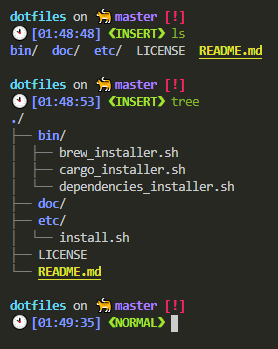

# README

dotfiles maintained by `illumination-k`



## Usage

### dotfiles

```bash
curl -L https://raw.githubusercontent.com/illumination-k/dotfiles/master/etc/install.sh | bash
```

### install cargo dependencies

```bash
curl -L https://raw.githubuercontent.com/illumination-k/dotfiles/master/bin/cargo_installer.sh | bash
```


### install dependencies

```bash 
# mac
curl -L https://raw.githubuercontent.com/illumination-k/dotfiles/master/bin/brew_installer.sh | bash

# linux
curl -L https://raw.githubuercontent.com/illumination-k/dotfiles/master/bin/linux_apt_installer.sh | bash
```

## License
MIT