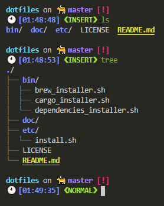

# dotfiles

dotfiles maintained by `illumination-k`

[](https://github.com/illumination-k/dotfiles/actions/workflows/install.yml)
[](https://github.com/illumination-k/dotfiles/actions/workflows/nix-test.yml)



## Usage

### dotfiles

```bash
curl -L https://raw.githubusercontent.com/illumination-k/dotfiles/master/etc/install.sh | bash
```

### install cargo dependencies

```bash
curl -L https://raw.githubuercontent.com/illumination-k/dotfiles/master/bin/cargo_installer.sh | bash
```


### install dependencies

```bash 
# mac
curl -L https://raw.githubuercontent.com/illumination-k/dotfiles/master/bin/brew_installer.sh | bash

# linux
curl -L https://raw.githubuercontent.com/illumination-k/dotfiles/master/bin/linux_apt_installer.sh | bash
```

### K8s dev pod (interactive Claude Code + herdr)

Nix + Home Managerベースのイメージ（`nix build .#docker-dev`、定義は `docker/images.nix`）を使って、
K8s上にinteractiveな開発環境（claude-code + herdr + sshd）を立てられる。
詳細は [k8s/claude-dev/README.md](k8s/claude-dev/README.md) を参照。

```bash
kubectl apply -k k8s/claude-dev
kubectl exec -it claude-dev-0 -- /usr/local/bin/dev-login
```

## License
MIT